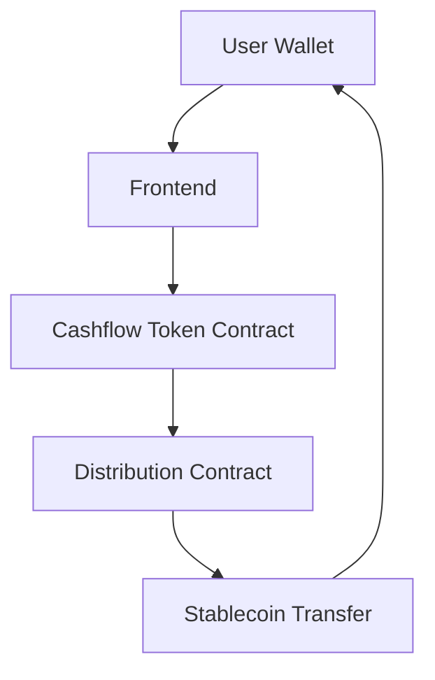

# BrickFi — RealFi on Mantle

**Build global real estate income from $50**

---

## 1. Overview

BrickFi is a **global real estate income investment service starting from just $50**.

BrickFi is not a service for buying and selling real estate itself, but a RealFi project that demonstrates tokenization of **economic rights to receive rental income from real estate** and transparent on-chain distribution.

This project is an MVP demo aimed at the Mantle Global Hackathon 2025, designed to be fully functional.

---

## 2. Problem

Traditional real estate investment has the following structural limitations:

* Most require or prefer physical site visits (time and distance constraints)
* Complex and difficult-to-understand contracts and legal structures
* High brokerage fees
* High initial investment requirements (seed money)
* Loan and interest burdens
* Serious information asymmetry for overseas properties

While rental income is a relatively stable revenue source, the current structure makes it difficult to participate with small amounts and revenue distribution processes are typically opaque.

---

## 3. Limitations of Existing Alternatives (REITs)

REITs (Real Estate Investment Trusts) have lowered the barriers to real estate investment but have the following limitations:

* Multiple real estate assets bundled into one portfolio
* Difficult to make investment decisions on individual properties
* Hard to perceive which assets actually generate income
* Centralized revenue distribution structure resembling a black box
* Unable to verify in real-time on-chain
* Limited global accessibility and transparency

---

## 4. Solution

BrickFi solves these problems with an on-chain income distribution structure.

**Core Approach**
* Tokenize economic rights to rental income from single properties
* Mint ERC-20 based income tokens proportional to investment amount
* Automatically distribute rental income through smart contracts
* All distribution records verifiable in real-time on block explorer

BrickFi provides **"the experience of participating in real estate income flow" rather than "the experience of owning real estate"**.

**Key Features**
* Property Decision View (investment decision screen)
* Cashflow(Income) Token minting
* Admin manual distribution trigger
* On-chain stablecoin distribution
* AI-based investment insight summary (simulation)

---

## 5. Demo

* **Live Demo URL (Mantle Testnet)**
  👉 https://brickfi.vercel.app/

---

## 6. Architecture

**Overall Structure (Logical Flow)**



* **Network**: Mantle Testnet
* **Real funds** ❌ (Demo environment)
* **All revenue, ratings, and AI data are for simulation purposes**

---

## 7. Smart Contracts

### Deployed Contracts (Mantle Sepolia)

- **USDC**: [`0xf6c6D352545Eb7316fD3034232ff7eF635325D6F`](https://sepolia.mantlescan.xyz/address/0xf6c6D352545Eb7316fD3034232ff7eF635325D6F)
- **PropertyFactory**: [`0x1619587D0d23dc67814C4C33A9639B6BDC163C18`](https://sepolia.mantlescan.xyz/address/0x1619587D0d23dc67814C4C33A9639B6BDC163C18)

### Contract Details

**1) Cashflow Token Contract (PropertyToken)**
* ERC-20 based
* Represents economic rights to rental income
* Proportional minting based on investment amount
* Decimal unit support

**2) Distribution Contract**
* Admin manually inputs monthly rental income
* Automatic distribution based on token holding ratio
* Stablecoin-based transfers
* All distribution transactions recorded on-chain

---

## 8. Business Model

BrickFi aims for a platform business model where platform utilization itself translates into revenue as a real estate income investment platform.

### 8.1 MVP Stage Revenue Model (Hackathon Focus)
* **Platform Transaction Fee**: 2% of investment amount
* Example: $50 investment → $1 platform fee
* During the hackathon MVP stage, focus is on **structural validation and UX demonstration** rather than actual revenue maximization

### 8.2 Expansion Stage Revenue Model

**(1) Listing Fee**
* Fee charged when registering real estate or assets on the platform
* Target: Asset holders, operators, asset origin partners
* Purpose: Maintain asset quality and prevent indiscriminate listings

**(2) Featured Listing Ads**
* Expose specific properties or assets at the top of main/category pages
* Charged based on exposure period (weekly/monthly)
* Limited exposure to areas with concentrated investor traffic

**(3) AI Investment Assistant Usage Fee**
* Basic information: Free
* Premium features monetization:
  * Asset comparison analysis
  * Advanced risk summary
  * Investment preference-based recommendations
  * Subscription or usage-based billing for individual investors

**(4) 3D Virtual Site Visit Feature Fee**
* Matterport/Polycam style 3D site visit content provision
* Billing targets:
  * Asset registrants (for listing differentiation)
  * Or investors (premium view access)
  * One-time payment per listing or included in premium plans

👉 **BrickFi aims for a structure where 'platform utilization' rather than transaction volume leads to revenue.**

---

## 9. Deployment

### Network Configuration

- **Network**: Mantle Sepolia (Chain ID: 5003)
- **RPC**: https://rpc.sepolia.mantle.xyz
- **Explorer**: https://sepolia.mantlescan.xyz/
- **Faucet**: https://faucet.sepolia.mantle.xyz/

### Get Test USDC

```bash
# Method 1: Faucet (easiest, 1,000 USDC)
cast send 0xf6c6D352545Eb7316fD3034232ff7eF635325D6F "faucet()" \
  --rpc-url https://rpc.sepolia.mantle.xyz \
  --private-key $PRIVATE_KEY --legacy

# Method 2: Mint custom amount
cast send 0xf6c6D352545Eb7316fD3034232ff7eF635325D6F \
  "mint(address,uint256)" <YOUR_ADDRESS> 10000000000 \
  --rpc-url https://rpc.sepolia.mantle.xyz \
  --private-key $PRIVATE_KEY --legacy
```

### Deploy New Contracts

See [DEPLOYMENT.md](https://github.com/brick-fi/contract/blob/main/DEPLOYMENT.md) for detailed deployment instructions.

---

## 10. Roadmap

**Phase 1 — Hackathon MVP**
* Real estate rental income-based structure
* Manual income input
* On-chain distribution structure demonstration

**Phase 2**
* Expand to other RWA assets like art and luxury goods
  (Real estate maintains income-based structure due to regulations, some RWA assets may explore ownership-based tokenization models)
* AI-based investment insights and decision support chatbot
* Remote 3D site visualization (Matterport/Polycam style)

---

## 11. Technical Specifications

* **Token Price**: $50 per token (fixed)
* **Platform Fee**: 2% (deducted from investment)
* **USDC Decimals**: 6
* **PropertyToken Decimals**: 18
* **Solidity Version**: 0.8.23

---

## 12. Compliance Declaration

* This project does not tokenize real estate ownership
* Demo token structure for rental income (revenue flow)
* No real funds, real KYC, or real legal rights transfer ❌
* This project is a functional validation MVP for hackathon submission

---

## 13. Team

* **PM & Frontend Developer**: Gayeon Hwang
* **Full-stack Developer**: Junghoon Ban

**Contact**
* Gayeon Hwang: pioninweb3@gmail.com
* Junghoon Ban: junghoon.ban@gmail.com

---

## Documentation

- [Contract DEPLOYMENT.md](https://github.com/brick-fi/contract/blob/main/DEPLOYMENT.md) - Deployment guide
- [Mantle Docs](https://docs.mantle.xyz/) - Network documentation
- [Foundry Book](https://book.getfoundry.sh/) - Foundry documentation
